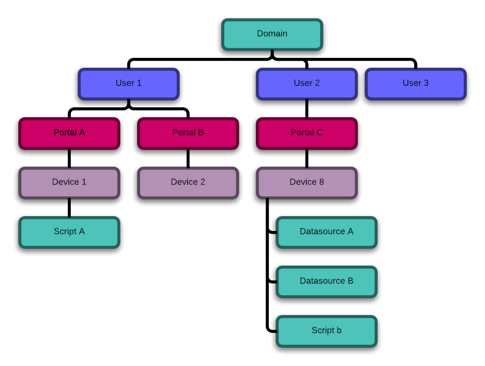

##############################################
How Does My Device Interact With One Platform?
##############################################
This page will give the reader a brief introduction to One Platform concepts.

Glossary
--------
.. glossary::
    One Platform
        An Exosite product that stores and processes data for your devices.
    
    Device
        Represented by a node in the One Platform tree.
    
    Datasource
        A device can have zero, or many , datasources attached to it.  
    
    CIK
        A 40 character hexadecimal string that is used to authenticate as a 
        node in the One Platform.  With the CIK, you can read/write data to a
        node, or any of its children
    
    RID
        A 40 character hexadecimal string that uniquely represents a node in the
        One Platform.  The RID never changes during the life of the node.
    
    Portals
        A grpahical frontend for managing users and resources on the Exosite
        One Platform.
    
    Scripts
        A lua script that processes data on the Exosite One Platform
    
    Datasources
        A named resource underneath a device that the device can write data to
        (e.g. temperature, humidity...)
   
What is One Platform?
--------------------- 
One Platform is the backend Exosite product that stores and processes all of
the data for your device.

Conceptually, everything in One Platform is part of a hierarchical tree.  If you
have a white label account, at the top of your tree is your domain node.  
Underneath the domain node, you have user nodes.  Each user in the system will
have their own node.  Beneath each user is zero, or many, Portal nodes.  A user
can also be granted access to another user's Portal.  Under each Portal node 
are device nodes.  

Although the above structure is the most common, your design is not limited to
this.  However, for the purposes of this guide, we will assume you are using the
above structure.

What Is A Device
----------------
One Platform represents each device as a node on the tree.  A device can have
scripts and datasources attached to it.  Datasources are used to store data and
scripts are used to process data.  A device on One Platform is meant to have a 
one-to-one relationship with a physical device.  For example, you may have a
physical device that can read the temperature in celsius.  To represent this
device on One Platform, you would create a device and name it ``thermometer``.
You would give add a datasource called ``temperature_celsius`` to the ``thermometer``
device.  *We're going to use the `thermometer` device as our example device
throughout the rest of this document.*

What Is The Difference Between An RID And a CIK?
------------------------------------------------
CIKs and RID are both 40 character hexadecimal strings.  They both have a
one-to-one mapping with a device.  The RID is used to identify a single device
on One Platform.  As soon as a device is created, it is assigned an RID.  For 
the life of the device, the RID never changes its only job is to give the device
a globally unique identifier.  The CIK is a key that is used to access a device.
The CIK for a device can be regenerated if the existing one is compromised or 
the original one is lost.

The relationship between a CIK and an RID is akin to the relationship between
the address of a house and the keys to that house.  Once a house is built, it's
given an address that is unique across the world.  Its address will never
change (much like an rid).  However, the locks to the house can be re-keyed, at
any time.  Re-keying a house is analogous to refreshing the cik of a device.  The
RID stays the same, but the old cik no longer allows access to it and the newly
generated cik now has access.

How Do I Read/Write Data From One Platform
------------------------------------------
Before you can read data from One Platform, you must first retrieve your devices
CIK.  This is typically obtained via :doc:`provisioning`.  Once you have the cik
for your device you use that cik to authenticate with One Platform using your
API of choice(:doc:`api_usage`)

.. note::
    Obtaining a portal/domain/user cik is possible, but not covered in this document.

Datasources
"""""""""""
Datasources are a named "port" that stores timeseries data for your device.  In
our temperature reading device example, the `temperature_celsius` would be the
datasource that the device would write its temperature reading into.

Let's say your device is currently reading a value of ``23`` (Celsius).  Using the
data api, you can tell One Platform to write the value of ``23`` to the ``temperature_celsius``
datasource with the following http request to m2.exosite.com. (We'll assume our
temperature device has a cik of `1234567890123456789012345678901234567890`)

.. code-block:: http

    POST /onep:v1/stack/alias HTTP/1.1 
    Host: m2.exosite.com 
    X-Exosite-CIK: 1234567890123456789012345678901234567890
    Content-Type: application/x-www-form-urlencoded; charset=utf-8 
    Content-Length: 22
    
    temperature_celsius=23

After this request, the ``temperature_celsius`` datasource on your device would
have a value of ``23`` that was indexed by the timestamp that One Platform
received it.

.. warning::
    You can only write to One Platform once per second.  If you try to write more
    then one data point (per datasource) in the same second, the behavior is undefined.
    
How do I Process My Data On One Platform
----------------------------------------
Processing data on One Platform is done using lua scripts.  Lua scripts are hosted
by your device node.  The scripts will typically wait for a piece of data from
your device and then do some processing on that data and do something with the
results of the processing (e.g. Send email/sms or update another datasource.

Let's say that we wanted to convert our temperature reading from Celsius to Fahrenheit.
To do this we would add a ``temperature_fahrenheit`` datasource to our device, and
a script called ``celsius_to_fahrenheit.lua``  The script would look like the
following:

.. code-block:: lua

    -- declare our datasources
    local temp_c = alias['temperature_celsius']
    local temp_f = alias['temperature_fahrenheit']

    while true do
        
        local ts = temp_c.wait()-- this call blocks until data arrives on temp_c.
        -- The returned value is the timestamp of when the device was written to
        -- One Platform.
        
        -- let's retrieve the value that the wait() told us about.
        local celsius_temp = temp_c[ts]
        
        -- Convert that value to Fahrenheit and write it to the `temperature_fahrenheit`
        -- datasource.
        temp_f.value = celsius_temp * (9/5) + 32
    

    
