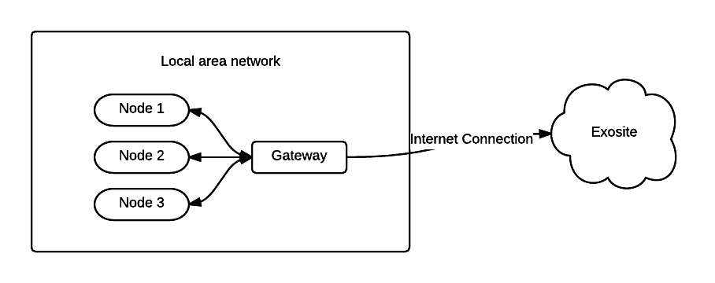

####################
Gateway Design Guide
####################
This document is intended to describe some typical uses of a gateway/node 
system and design guidelines for implementing a system.

What Is A Gateway/Node System?
------------------------------
Gateway/node systems are described by a system where one, or many, node devices 
uses the Internet connection of a single device (the gateway).  The gateway 
typically communicate with the nodes via a local wire or wired network (e.g. 
BACnet, Bluetooth, CAN, Modbus...) and communicates with Exosite via a cellular, 
Ethernet, or WiFi network.

.. Glossary::

    Gateway
        A device that has a connection to the Internet.  This connection can be WiFi,
        Ethernet, cellular, or any other link that allows it to talk to Exosite.  The
        gateway will also have a way to communicate with local nodes

    Node
        A device that has data it needs to send to Exosite, but it doesn't 
        have its own connection to Exosite.  It therefore relays that data through
        a gateway.

Gateway/Node System Architectures
---------------------------------
There are typically two different ways that the gateway/node system send data 
up to Exosite:
1. Batch sending
2. Real-time sending

Batch sending
~~~~~~~~~~~~~
With the batch sending method, when the gateway receives data from the nodes, 
it will store the data in memory, or on disk.  At regular intervals (e.g. once 
a day) it will send all of the stored data up to Exosite.

Advantages
""""""""""
* Since the gateway opens a socket to Exosite at a slower rate (e.g. once per day) 
  the system is able to reduce the data overhead of opening a socket for every piece of data
* For low power systems, the modem wakes up less often, thus improving battery life.

Disadvantages
"""""""""""""
* The main disadvantage to the batch sending method is the loss of real-time\
  data viewing.  By storing the data on the local gateway, the end user is unable
  to see that data until the gateway sends the data up to Exosite.
* The end user is unable to receive real-time alert notifications (e.g. over temperature condition).

When using the batch send method, it typically also requires that your gateway 
have access to an accurate time source. This allows the gateway to store the 
actual timestamp of when the node sends the data.  If you have an accurate 
timestamp, when all of the batch data is finally sent to Exosite, the timestamps 
can be included with it, allowing the UI to be able to show when each individual datapoint occurred.

Real-time sending
~~~~~~~~~~~~~~~~~
With Real-time sending, the gateway sends data as soon as it receives it from the nodes.

Advantages
""""""""""
* The user is able to always see the most recent data in their cloud UI
* Notifications are able to be sent immediately when a threshold is crossed.
* Since Exosite is able to timestamp  the record as soon as it receives it, the 
  gateway does not necessarily need access to a time source.

Disadvantages
"""""""""""""
* The data overhead of all these connections uses much more data than a single 
  batch report.
* If an Internet connection is unavailable, the application will either need to 
  throw the data on the ground, or decide how to buffer it.

The overhead of a typical TCP/IP/HTTP request/response is around 1.3kB.  This 
means that even though your payload may only be 20 bytes long, each request/response 
will use 1.3kB of data.  On cellular networks this has the potential to add up 
quickly and result in unexpected cellular data usage numbers.

Hybrid approach
~~~~~~~~~~~~~~~
Often times a solution ends up being a hybrid of the above two approaches.  
Using a hybrid approach allows the application to gain some of the benefits of 
each approach while still keeping some of the benefits of the other approach.

One popular method is to batch data and send on regular intervals, but if some 
predefined condition happens the batched data can be sent up earlier.  For 
example a gateway is programmed to batch a nodes temperature data for one day.  
At the end of a 24 hour period, the gateway should send all of the batched data 
for the previous day.  

Let's say, for this example, that the user wants to be notified when the 
temperature goes above 40.  If the application was developed using a pure batch 
and send method,  the user wouldn't know that the temperature violation occurred 
until after the 24 hour report had been sent.  If we instead update the gateway 
app to send its batched data every 24 hours, or when it receives a reading over 
40, we save on bandwidth usage during normal operations but are still able to 
get real-time notifications of when violations occur.

In the above situation the gateway acts in batch mode when things are working 
as expecting and goes to real-time mode when a special condition happens.  

Another potential architecture is to have the device send all data up in real 
time, but when the connection to Exosite goes down, fall back to a batch mode 
to keep data points stored locally on the gateway until the connection is restored 
and the points can be sent to Exosite.  This allows you to keep all the benefits 
of real-time reporting, but you are also able to handle periods of offline time.

Important consideration when choosing an architecture
-----------------------------------------------------
Often times the deciding factor for choosing an architecture is how the gateway 
will connect to Exosite.  If the connection is over cellular, data usage tends 
to be much more expensive and a more batch send type architecture is used.  If 
the connection is using WiFi or Ethernet, data usage typically isn't a concern 
and the architecture slides more towards the real-time end.

Choosing a connection type
--------------------------
Connection types are typically divided into the follow three categories:

1. Cellular
2. WiFi
3. Ethernet

Cellular
~~~~~~~~
Cellular devices use a cellular network to communicate with One Platform.  The
networks used for communications are often the same networks that cell phones
use.

WiFi
~~~~
Gateways that use WiFi use the same WiFi networks that your computer connects to.

Ethernet
~~~~~~~~
Ethernet connections are hardwired connections that connect directly to a network
with access to the 

Given the choice, a non-cellular connection type is almost always the preferred 
method of connection.  However, there is one potential drawback to using the 
end user's Ethernet connection, and that is their network infrastructure.  Often 
times an end users network will have firewalls and/or proxies in place to protect 
against malicious activity. Unfortunately, these security devices also can
hamper your gateway's activity.  Making it difficult, or impossible for your data 
to reach Exosite's servers.

When choosing the gateway's Internet connection, it often involves a balance 
between the complexities of navigating the end users IT network policies and 
the cost of a recurring cellular bill, in combination with the desired 
architecture (batch vs real-time sending).

General best practices
----------------------
* When possible, always UTC time or Linux epoch time.  This makes dealing with 
  different timezones much easier
* Use separate threads for asynchronous communications to the local network and Exosite

Additional Topics
-----------------
.. toctree::
   :maxdepth: 1
   
   choosing_device_hierarchy
   provisioning
   api_usage
   gateway_engine
   
