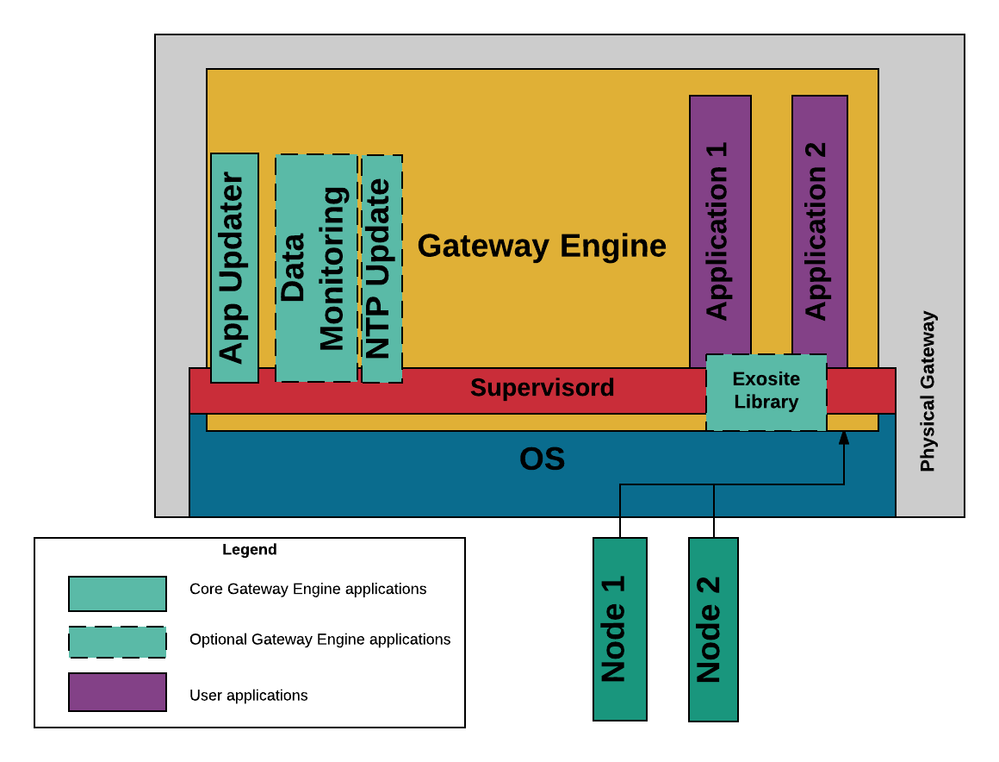

##############
Gateway Engine
##############
Gateway Engine is a framework that eases the development of gateway applications.

Key Features
------------
It provides the following key features:

Application Hosting
~~~~~~~~~~~~~~~~~~~
Gateway Engine's core feature is to provide a framework for you application/s
to run in.  Allowing you to focus development efforts on just the business
logic of your application.

Process Monitoring
~~~~~~~~~~~~~~~~~~
Gateway Engine incorporates `Supervisord <http://supervisord.org/>`_ to watch
application processes and make sure that if they die, they will be restarted.

Application Logging
~~~~~~~~~~~~~~~~~~~
Gateway Engine captures all of an applications stdout and writes that to a log
file.  The Log files are automatically rotated and the oldest ones deleted,
ensuring that your logs won't fill up your disk space.

Bandwidth Usage and Monitoring (Beta)
~~~~~~~~~~~~~~~~~~~~~~~~~~~~~~~~~~~~~
If using the Exo-Python module, Gateway Engine can automatically watch your
bandwidth for you and help make sure that you don't have any unexpected costly
cellular bills.

.. warning:: This feature is still in early beta and is still being tested

Application Updates
~~~~~~~~~~~~~~~~~~~
Gateway Engine allows you to remotely update your application by using the 
Exosite Content Area.

Exosite Interface Module
~~~~~~~~~~~~~~~~~~~~~~~~
Gateway Engine comes with a Python module that allows your application to easily
communicate with Exosite.
 

Block Diagram
-------------
The following block diagram shows the basic pieces of Gateway Engine:

App Updater
    Allows remote updates of applications.

Data Monitoring/NTP Update
    Optional applications that are provided with Exosite.  They are used
    to monitor your data usage and keep the system clock up to date.
    
Supervisord
    Makes sure that applications start on boot and restarts them if they
    die.
    
Application 1/2
    Your business application.  You can have 1 or many applications running
    on in Gateway Engine.
    
Exosite Library
    A Python library that is uses to track data usage as well as provide an
    interface for Python applications to use.
    
Node 1/2
    Your node devices that are communicating with the gateway.

