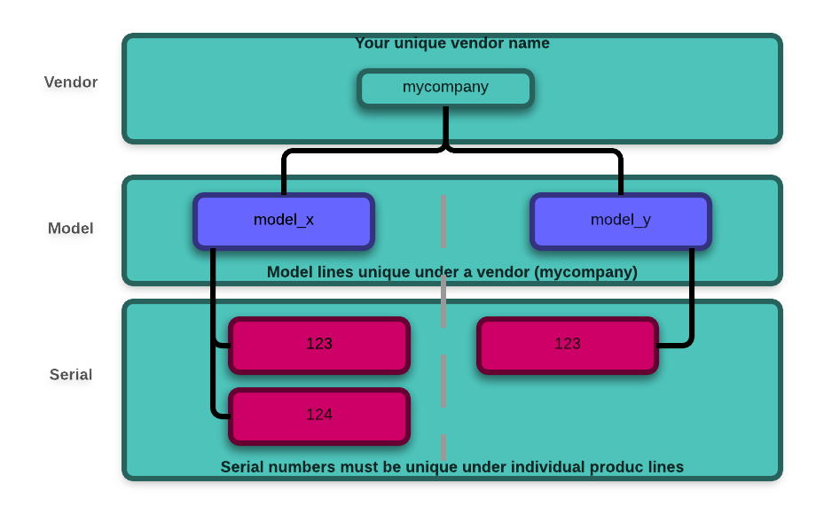

############
Provisioning
############
For a physical device to communicate with with Exosite, it must first obtain a CIK.  
Before this can happen, you need to add the device to your Exosite account using 
Portals.  The CIK can than be obtained one of two ways:
    
1. Hardcoding the CIK into your application code
2. Retrieving the CIK over the provisioning API.

This document covers how to retrieve the CIK through the provisioning API.

The Exosite provisioning API requires 3 pieces of information:

1. ``vendor``
2. ``model``
3. ``sn`` (serial number)

The vendor and model are set when the client model is created.  The `vendor`
name is unique among all Exosite customers, the `model` is unique under each 
Exosite customer, and the `sn` is unique among all models.

We will be covering the portion of the API that allows a device to retrieve its
CIK, but more detailed documentation about the provisioning API can be found on
`Github <https://github.com/exosite/api/blob/master/provision/>`_

A device can be in 3 different states.

1. `Pending Activation`
2. `Activated`
3. `Expired`

When a device is first added to a Portal, it is in the `Pending Activation` state.
This means that a device is eligible to activate on the platform, but has not
yet done so.  If a device doesn't successfully activate after 24 hours, it will
go into the `Expired`.  This means that even if the device calls in to activate
it will not succeed.  The device will nee to be "re-enabled" before it can 
successfully complete its activation.  If a device does successfully activate
within the 24 hour window.  It will be in the `Active` state and able to receive
data through the OneP API's.

The provisioning API allows a device to retrieve its CIK.  This method only
works when a device is unactivated.  After the call has been made the device
will activate and it will no longer be able to retrieve its CIK through this 
API.

The HTTP request to retrieve a CIK looks like the following:

.. code-block:: http

    POST /provision/activate HTTP/1.1
    Host: m2.exosite.com
    Content-Type: application/x-www-form-urlencoded; charset=utf-8
    Content-Length: <length>
    
    vendor=<vendor>&model=<model>&sn=<sn>

Where `<vendor>`, `<model>`, and `<sn>` will be specific for your individual project.

This request can return four different response codes:

 1. `200` -- Request was accepted and the response body will have the CIK
 2. `404` -- The serial number of the device isn't in the 1P
 3. `403` -- Invalid vendor/model pair
 4. `409` -- Device has not yet been added to a portal, or it has already been
    added to a portal and gone through its activation process.

